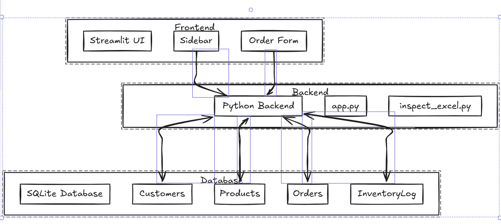

# AMBA_ERP
# Amba ERP System - Stage 2 Prototype

## 🔍 1. Company Research & Initial Assessment

Amba Enterprises Limited is a respected manufacturer of transformer laminations and motor stampings. Currently, operations (Orders, Inventory, Accounts) are manually tracked using Excel sheets.  

**Top 3 Pain Points / Inefficiencies:**
1. **Manual Order Tracking:** Leads to human errors, delayed order processing, and difficulty in reporting.
2. **Inventory Visibility:** Lack of centralized inventory management causes stockouts, overstock, and inefficient resource utilization.
3. **Cashflow & Payments:** Outstanding payments are hard to track; no automated reminders or reporting exist.

---

## ⚖️ 2. Build vs. Buy Strategy

**Recommendation:** Build the ERP system in-house using **Python + Streamlit**.

**Justification:**
- **Build (Python/Streamlit):**
  - Low-cost, highly flexible, suitable for small teams.
  - Easy integration with future AI/LLM or Power Automate workflows.
  - Rapid development and low maintenance.
- **Buy (Open-Source ERP):**
  - Licensing and high customization effort.
  - Longer learning curve and maintenance overhead.
  
**Conclusion:** Building the ERP is more cost-effective and aligns with the project constraints (single developer, low budget, high maintainability).

---

## ️3. System Architecture & Technology Stack




**Technology Stack:**
- **Frontend:** Streamlit — quick UI creation, interactive forms, and dashboards.
- **Backend:** Python — core logic, data processing, and SQL generation.
- **Database:** SQLite — lightweight, free, and sufficient for 5-50 users.
- **Integration:** Power Automate (optional) for workflow automation, AI/LLM for future analytics

## ️4. Data Modeling Document

**Database Schema (`schema.sql`):**

**Customers (Master Data)**
- `customer_id` INT PRIMARY KEY
- `customer_name` TEXT UNIQUE
- `total_order_value` FLOAT
- `total_collected` FLOAT
- `outstanding_balance` FLOAT
- `last_payment_date` DATE

**Products (Inventory)**
- `product_id` INT PRIMARY KEY
- `product_name` TEXT UNIQUE
- `unit_price` FLOAT
- `stock_quantity` INT

**Orders (Transactional Data)**
- `order_id` INT PRIMARY KEY
- `customer_id` INT REFERENCES Customers(customer_id)
- `order_date` DATE
- `order_value` FLOAT
- `amount_collected` FLOAT
- `last_payment_date` DATE

**InventoryLog (Ledger)**
- `log_id` INT PRIMARY KEY
- `product_id` INT REFERENCES Products(product_id)
- `transaction_type` TEXT (IN / OUT)
- `quantity` INT
- `transaction_date` DATETIME

**Indexes / Integrity:**
- Indexed `customer_name` and `product_name` for fast lookups.
- Foreign Keys ensure relational integrity.
- Primary Keys uniquely identify records.

---

## 5. Detailed Implementation Flow

### Workflow for Creating a New Sales Order
1️⃣ User Interaction

User opens the “Create New Sales Order” form in the Streamlit UI.

Enters the following details:

Customer Name

Product

Quantity

Amount Collected


2️⃣ Validation & Processing

System validates all mandatory fields (e.g., Customer Name, Quantity).

Checks stock availability for the selected product.

Calculates order value = Quantity × Unit Price.

3️⃣ Backend Logic (Python Layer)

Generates the SQL INSERT query for the Orders table.

Generates a corresponding SQL INSERT for the InventoryLog table to record stock deduction.

Returns both SQL statements as output (prototype does not commit to the database).

4️⃣ Response

Streamlit UI displays confirmation with both generated SQL statements.

🌐 REST API Endpoints (Illustrative Design)

Below is a hypothetical REST API structure designed for future backend expansion.

Method	Endpoint	Description
POST	/api/v1/orders	Create a new sales order
GET	/api/v1/customers	Retrieve all customers
GET	/api/v1/inventory	Retrieve current inventory

1️⃣ POST /api/v1/orders

Purpose: Create a new sales order.

Sample Input JSON
{
  "customer_name": "Customer 6",
  "product_name": "Transformer Laminations",
  "quantity": 10,
  "amount_collected": 5000,
  "last_payment_date": "2025-07-30"
}

Sample Output JSON
{
  "status": "success",
  "message": "Order validated successfully",
  "sql_queries": {
    "insert_order": "INSERT INTO Orders (...) VALUES (...);",
    "insert_inventory_log": "INSERT INTO InventoryLog (...) VALUES (...);"
  }
}

2️⃣ GET /api/v1/customers

Purpose: Retrieve list of all customers.

Sample Response
[
  { "customer_id": 1, "customer_name": "Customer 1" },
  { "customer_id": 2, "customer_name": "Customer 2" }
]

3️⃣ GET /api/v1/inventory

Purpose: Retrieve product details and stock availability.

Sample Response
<pre>
[
  { "product_id": 1, "product_name": "Transformer Laminations", "stock_quantity": 120, "unit_price": 1500 },
  { "product_id": 2, "product_name": "Motor Stamping", "stock_quantity": 80, "unit_price": 2000 }
]
</pre>


🧱 Class / Method Diagram (Python Logic)
 
---

## 6. Prototype & Deployment

**Prototype Features (Streamlit App):**
- Display **Inventory List** from Excel file.
- Form to **submit a new order**.
- Validates user input and generates SQL statements.
- Sidebar navigation for interactive UI.

**Deployment:**  
Deployed to Streamlit Cloud (live URL to be added).

---

## 7. Local Setup Instructions

```bash
# Clone repo
git clone <repo-url>
cd amba_erp

# Create virtual environment
python -m venv venv

# Activate venv
venv\Scripts\activate  # Windows
# source venv/bin/activate  # macOS/Linux

# Install dependencies
pip install -r requirements.txt

# Run Streamlit app
streamlit run app.py
